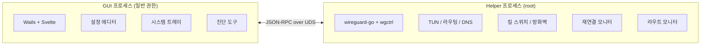

<p align="center">
  
</p>

<h1 align="center">WireGuide</h1>

<p align="center">
  모던 UI와 편의 기능을 갖춘 네이티브 macOS WireGuard VPN 클라이언트
</p>

<p align="center">
  <a href="https://github.com/korjwl1/wireguide/releases/latest"></a>
  <a href="#설치"></a>
  
  <a href="LICENSE"></a>
</p>

<p align="center">
  <a href="README.md">English</a>
</p>

---

## 왜 만들었나?

공식 WireGuard macOS 클라이언트(v1.0.16)는 2023년 2월 이후 업데이트되지 않았습니다. 대부분의 사용자에게는 잘 동작하지만, 패치되지 않은 알려진 문제들이 있습니다 — 특히 Split DNS, 슬립/웨이크 복구, 킬 스위치 미지원 등.

WireGuide는 구체적인 불편함에서 시작했습니다: macOS Tahoe 업데이트 후 M1 MacBook Air에서 공식 클라이언트가 심각한 시스템 렉을 유발했고, 수정 방법이 없었습니다. 기다리기보다 직접 만들면서, 공식 앱에 없는 기능들도 추가했습니다.

### 공식 macOS 클라이언트의 알려진 문제

아래는 문서화된 이슈입니다 — 모든 사용자에게 발생하는 것은 아니지만, 보고되었고 수정되지 않았습니다:

| 이슈 | 설명 | 출처 |
|------|------|------|
| **Split DNS** | AllowedIPs가 `0.0.0.0/0`이 아니면 DNS 무시됨 | [wireguard-apple PR #11](https://github.com/WireGuard/wireguard-apple/pull/11) — 4년 이상 미병합 |
| **연결 해제 후 DNS 잔류** | 슬립/웨이크 후 연결 해제해도 DNS 미복원 | [wireguard-tools PR #22](https://github.com/WireGuard/wireguard-tools/pull/22) |
| **킬 스위치 없음** | 터널 종료 시 트래픽 차단 옵션 없음 | — |
| **GitHub 이슈 없음** | 공개 버그 트래커 없음 | [HN 토론](https://news.ycombinator.com/item?id=43369111) |

### WireGuide가 추가하는 기능

- **킬 스위치** — macOS `pf`로 VPN 외 모든 트래픽 차단 (선택, 기본 꺼짐)
- **DNS 보호** — DNS 쿼리를 VPN으로만 강제 (선택)
- **슬립/웨이크 복구** — 웨이크 이벤트 감지 및 재연결 처리
- **라우트 모니터** — 게이트웨이 변경 시 엔드포인트 바이패스 라우트 재적용
- **설정 에디터** — CodeMirror 6 기반 WireGuard 문법 강조 및 자동완성
- **드래그 앤 드롭 가져오기** — `.conf` 파일 드롭으로 터널 추가
- **헬스 체크** — 핸드셰이크 상태 모니터링, 터널 무응답 시 재연결 (선택, 기본 꺼짐, `PersistentKeepalive` 사용 시 권장)

### wireguard-go 버전

WireGuide는 2025년 5월 빌드의 wireguard-go를 사용합니다 (공식 앱 대비 57커밋 앞섬). 데드락 수정, 소켓 버퍼 개선, 핸드셰이크 성능 향상 등이 포함됩니다. 자세한 내용은 [wireguard-go 커밋 로그](https://github.com/WireGuard/wireguard-go/commits/master)를 참조하세요.

---

## 설치

### macOS (Homebrew)

```bash
brew tap korjwl1/tap
brew install --cask wireguide
```

### macOS (수동)

[Releases](https://github.com/korjwl1/wireguide/releases)에서 다운로드 후 `/Applications`으로 이동.

> macOS에서 "앱이 손상되었습니다" 경고가 뜨면: `xattr -cr /Applications/WireGuide.app`

### 소스에서 빌드

```bash
# 사전 요구
brew install go node
go install github.com/go-task/task/v3/cmd/task@latest
go install github.com/wailsapp/wails/v3/cmd/wails3@latest

# 빌드
task build

# 실행
./bin/wireguide
```

---

## 스크린샷

<table>
  <tr>
    <td align="center"><br><sub>VPN 연결됨 — 실시간 통계 및 속도 그래프</sub></td>
    <td align="center"><br><sub>설정 에디터 — WireGuard 문법 강조</sub></td>
  </tr>
  <tr>
    <td align="center"><br><sub>에디터 자동완성 — 필드 제안</sub></td>
    <td align="center"><br><sub>네트워크 진단</sub></td>
  </tr>
  <tr>
    <td align="center"><br><sub>설정 — 테마, 언어, 로그 레벨</sub></td>
    <td align="center"><br><sub>로그 뷰어 — 레벨 필터링, 자동 스크롤</sub></td>
  </tr>
  <tr>
    <td align="center"><br><sub>빈 상태 — .conf 드래그 앤 드롭 가져오기</sub></td>
    <td align="center"><br><sub>시스템 트레이 메뉴</sub></td>
  </tr>
</table>

---

## 기능

| 기능 | 설명 |
|------|------|
| **터널 관리** | `.conf` 파일 가져오기, 생성, 편집, 내보내기. 드래그 앤 드롭 지원. |
| **설정 에디터** | CodeMirror 6 기반 WireGuard 문법 강조 및 자동완성 |
| **시스템 트레이** | 연결 상태 뱃지 (초록 점), 1클릭 연결/해제 |
| **킬 스위치** | macOS `pf`로 VPN 외 모든 트래픽 차단 (선택) |
| **DNS 보호** | DNS 쿼리를 VPN 터널로만 강제 (선택) |
| **헬스 체크** | 핸드셰이크 상태 모니터링 및 자동 재연결 (선택) |
| **슬립/웨이크 복구** | 시스템 웨이크 감지 및 터널 복구 |
| **라우트 모니터** | 게이트웨이 변경 시 엔드포인트 바이패스 라우트 재적용 |
| **충돌 감지** | Tailscale 등 다른 WG 인터페이스와의 라우트 충돌 경고 |
| **진단 도구** | Ping 테스트, DNS 유출 검사, 라우트 테이블 시각화 |
| **자동 업데이트** | GitHub Releases 확인; `brew upgrade` 및 직접 설치 지원 |
| **속도 대시보드** | 실시간 RX/TX 그래프 |
| **다국어** | 영어, 한국어, 일본어 |
| **테마** | 다크 / 라이트 / 시스템 자동 |

---

## 아키텍처



- **단일 바이너리** — `wireguide`가 GUI 또는 helper로 동작 (`--helper` 플래그)
- **권한 분리** — GUI는 일반 권한; helper는 root로 실행
- **IPC** — Unix 소켓 (macOS/Linux) 또는 Named Pipe (Windows) 위 JSON-RPC
- **Helper 수명** — 터널 활성 중에는 종료하지 않음 (wg-quick 시맨틱)

---

## 기술 스택

| 구성 요소 | 기술 |
|-----------|------|
| 언어 | Go 1.25+ |
| GUI | [Wails v3](https://wails.io) |
| 프론트엔드 | Svelte + Vite |
| WireGuard | [wireguard-go](https://git.zx2c4.com/wireguard-go) + [wgctrl-go](https://github.com/WireGuard/wgctrl-go) |
| IPC | JSON-RPC over Unix socket / Named pipe |
| 에디터 | [CodeMirror 6](https://codemirror.net/) |
| 방화벽 | macOS `pf` / Linux `nftables` / Windows `netsh advfirewall` |

---

## 후원

<a href="https://github.com/sponsors/korjwl1">
  
</a>

WireGuide가 유용하셨다면 후원으로 개발을 지원해 주세요.

---

## 라이선스

[MIT](LICENSE)
