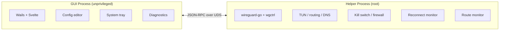

<p align="center">
  
</p>

<h1 align="center">WireGuide</h1>

<p align="center">
  A cross-platform WireGuard VPN client with a modern UI, kill switch, and auto-reconnect.
</p>

<p align="center">
  <a href="https://github.com/korjwl1/wireguide/releases/latest"></a>
  <a href="https://github.com/korjwl1/wireguide/stargazers"></a>
  <a href="#install"></a>
  
  <a href="LICENSE"></a>
</p>

<p align="center">
  <a href="README.ko.md">한국어</a>
</p>

---

<table>
  <tr>
    <td align="center"><br><sub>VPN Connected</sub></td>
    <td align="center"><br><sub>Config Editor</sub></td>
  </tr>
  <tr>
    <td align="center"><br><sub>Autocomplete</sub></td>
    <td align="center"><br><sub>Settings</sub></td>
  </tr>
</table>

---

## Install

Tested on **macOS 15+ (Apple Silicon)** and **Windows 11 (amd64)**.

### macOS (Homebrew) — recommended

```bash
brew tap korjwl1/tap
brew install --cask wireguide
```

### macOS (Manual)

Download from [Releases](https://github.com/korjwl1/wireguide/releases), unzip, move to `/Applications`.

> If macOS shows "app is damaged", run: `xattr -cr /Applications/WireGuide.app`

### Windows (Installer)

Download the latest `WireGuide-windows-amd64.exe` (or `-arm64.exe`) installer from
[Releases](https://github.com/korjwl1/wireguide/releases) and run it. The NSIS
installer registers the helper service and shortcut.

> Windows SmartScreen may warn that the publisher is unknown — the binary is
> currently unsigned. Click "More info" → "Run anyway".

### Build from Source

```bash
brew install go node
go install github.com/go-task/task/v3/cmd/task@latest
go install github.com/wailsapp/wails/v3/cmd/wails3@latest

task build
./bin/wireguide
```

---

## Features

| Feature | Description |
|---------|-------------|
| **Wi-Fi Auto-Connect** | Per-tunnel SSID rules: auto-connect on join, auto-disconnect on leave, trusted networks. Runs in the helper — works even when the GUI is closed. |
| **Multi-Tunnel** | Connect multiple WireGuard tunnels simultaneously with per-tunnel state |
| **Tunnel Management** | Import, create, edit, export `.conf` files. Drag-and-drop import. |
| **Config Editor** | CodeMirror 6 with WireGuard syntax highlighting and autocompletion |
| **System Tray** | Connection status badge, 1-click connect/disconnect |
| **Kill Switch** | Blocks all non-VPN traffic — macOS `pf`, Linux `nftables`, Windows WFP (optional) |
| **Loop Protection** | Always-on WFP filter blocks encrypted peer traffic from re-entering the tunnel adapter — defends against the routing-loop / "upload spike" class of bug on Windows full-tunnel even when the bypass /32 host route is missing |
| **DNS Protection** | Forces DNS queries through the VPN tunnel only (optional) |
| **Health Check** | Handshake age monitoring with auto-reconnect (optional) |
| **Sleep/Wake Recovery** | macOS `NSWorkspace`, Linux `systemd-logind`, Windows power notifications |
| **Route Monitor** | Re-applies endpoint bypass routes on gateway changes — macOS `RTM`, Linux netlink, Windows `NotifyIpInterfaceChange` |
| **Pin Interface** | Prevents latency spikes on dual-network (WiFi + Ethernet) setups |
| **Conflict Detection** | Warns about route conflicts with Tailscale, other WG interfaces, etc. |
| **Diagnostics** | DNS leak test, route table visualization |
| **Auto-Update** | Checks GitHub Releases; supports `brew upgrade` and direct install |
| **Speed Dashboard** | Real-time RX/TX graph |
| **i18n** | English, Korean, Japanese |
| **Dark / Light / System** | Follows OS appearance |

Uses [wireguard-go](https://git.zx2c4.com/wireguard-go) (May 2025), 57 commits ahead of the official macOS app's engine.

---

## Architecture



- **Single binary** — `wireguide` runs as GUI or helper (`--helper` flag)
- **Privilege separation** — GUI is unprivileged; helper runs as root
- **IPC** — JSON-RPC over Unix socket (macOS/Linux) or named pipe (Windows)

---

## Tech Stack

| Component | Technology |
|-----------|-----------|
| Language | Go 1.25+ |
| GUI | [Wails v3](https://wails.io) |
| Frontend | Svelte + Vite |
| WireGuard | [wireguard-go](https://git.zx2c4.com/wireguard-go) + [wgctrl-go](https://github.com/WireGuard/wgctrl-go) |
| Editor | [CodeMirror 6](https://codemirror.net/) |
| Firewall | macOS `pf` / Linux `nftables` / Windows WFP (Filtering Platform) |

---

## Contributing

See [CONTRIBUTING.md](CONTRIBUTING.md) for development setup and guidelines.

Found a bug? [Open an issue](https://github.com/korjwl1/wireguide/issues/new/choose).

---

## Sponsor

<a href="https://github.com/sponsors/korjwl1">
  
</a>

If WireGuide is useful to you, consider sponsoring to support development.

---

## License

[MIT](LICENSE)

---

## Code signing

The Windows installer is code-signed via SignPath Foundation once the
project's OSS application is approved. Signing infrastructure is
contributed by [SignPath.io](https://signpath.io); the certificate is
issued by [SignPath Foundation](https://signpath.org). Signing policy
is documented in [SIGNING-POLICY.md](SIGNING-POLICY.md).

> Free code signing provided by [SignPath.io](https://signpath.io),
> certificate by [SignPath Foundation](https://signpath.org).

Until the SignPath application is approved, releases ship unsigned and
SmartScreen will show a yellow "publisher unknown" warning on first
run. The CI workflow detects the absence of the SignPath secret and
publishes the unsigned `.exe` with a workflow warning rather than
failing the release.

If SignPath Foundation declines the application (the OSS programme has
no documented project-age / star-count threshold but approvals tend
toward more-established projects), the fallback is Microsoft's Azure
**Artifact Signing** service (renamed from "Trusted Signing" in
January 2026). At time of writing, the individual-developer eligibility
for Public Trust certificates is limited to applicants in the United
States and Canada; users outside those jurisdictions can use Azure
Artifact Signing only under an organisation identity (registered legal
business entity required). For a solo maintainer in Korea, this means
forming a legal entity before the fallback path is open — the cost is
not a flat ~$10/month subscription, the prerequisite is the entity
registration itself.
