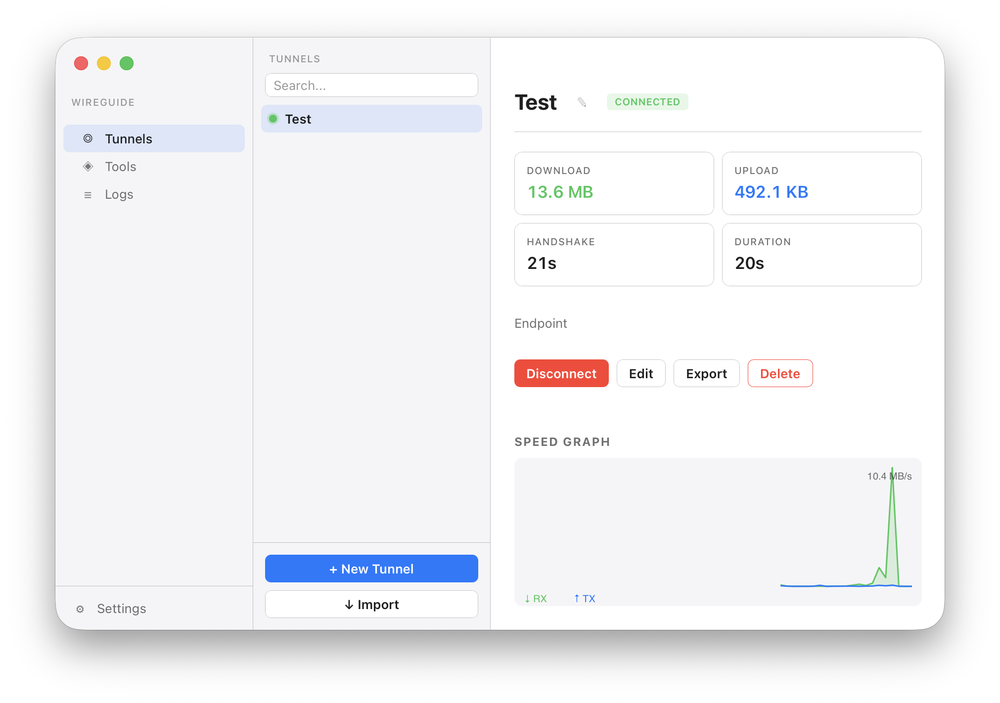
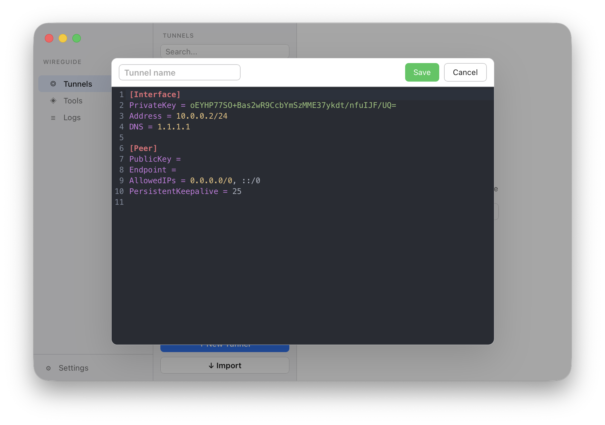
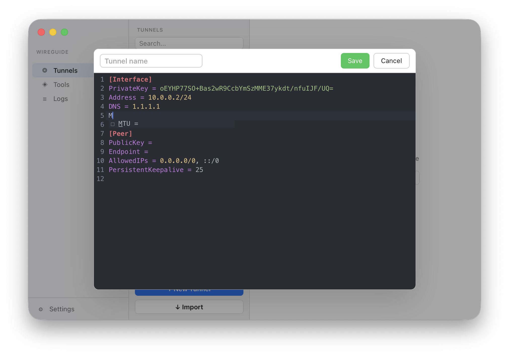
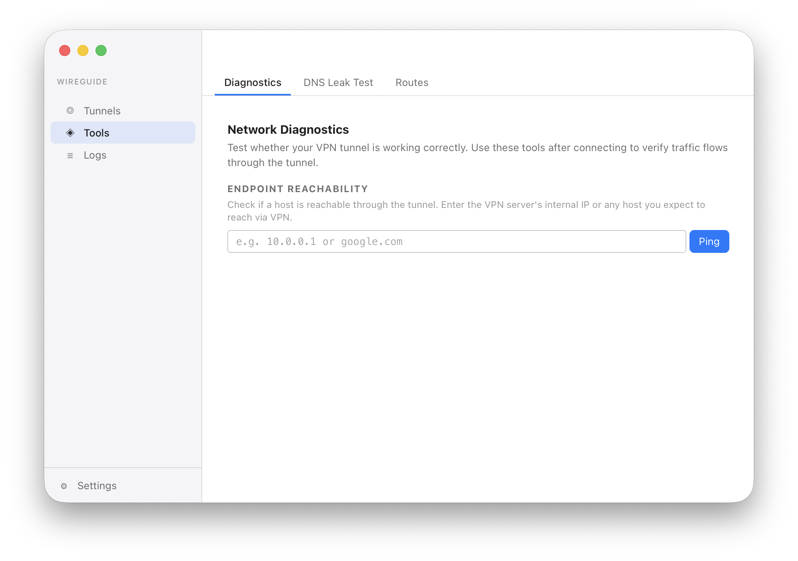
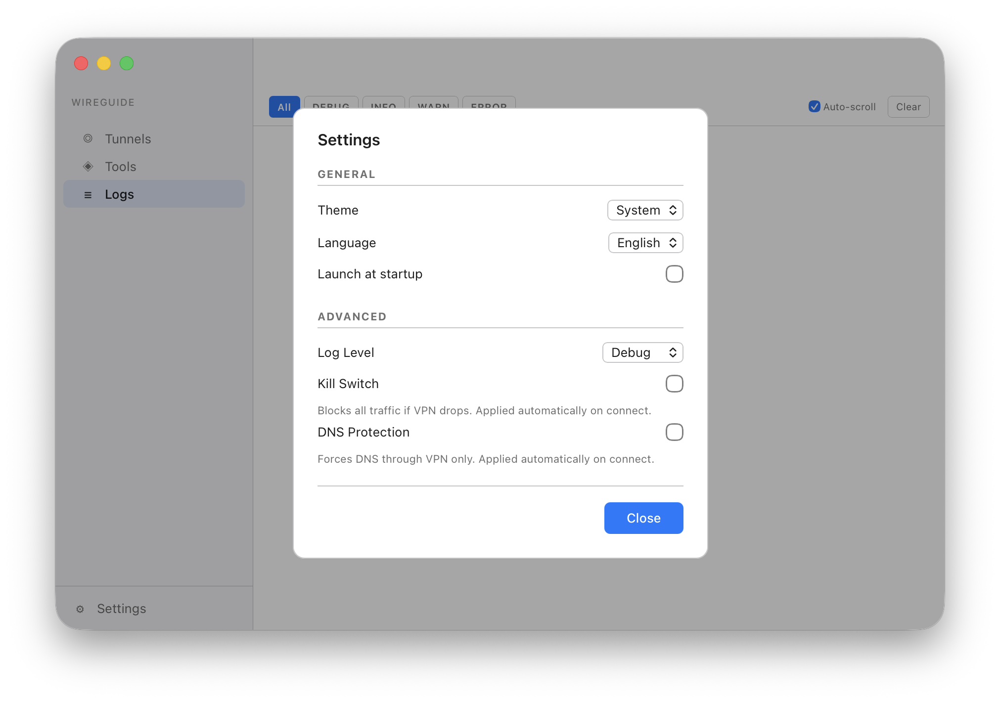
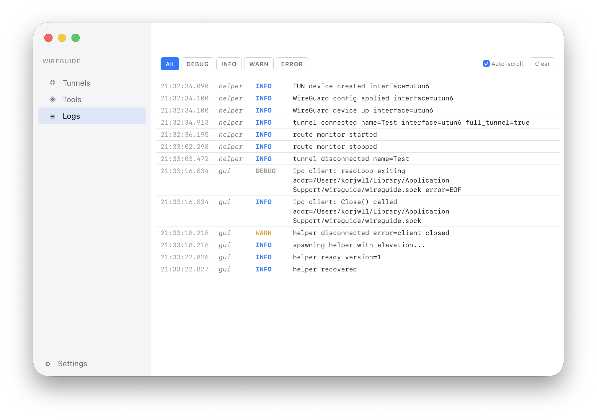
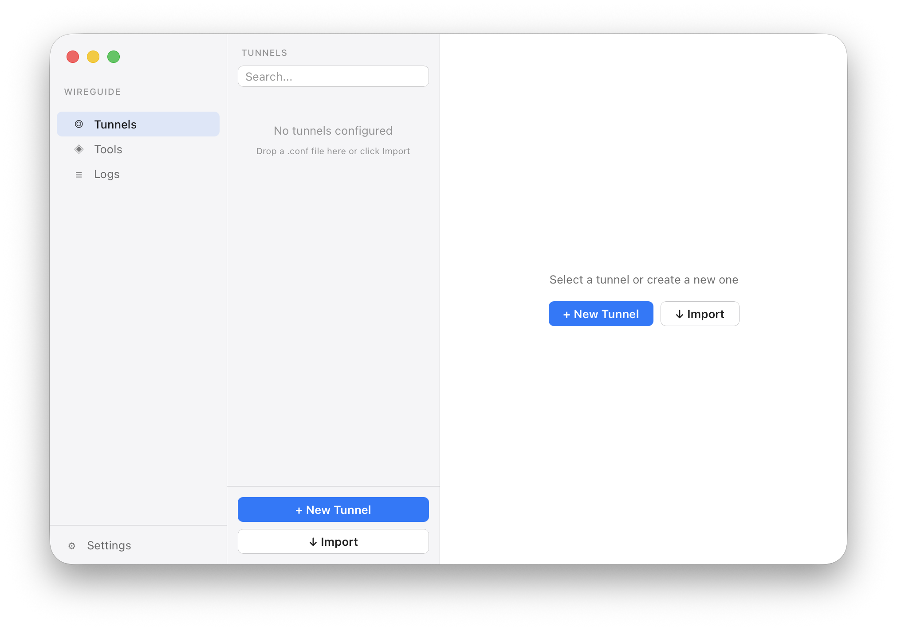
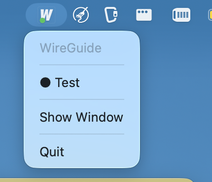
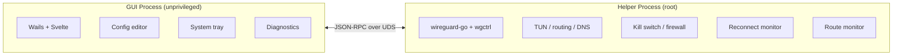

<p align="center">
  
</p>

<h1 align="center">WireGuide</h1>

<p align="center">
  A cross-platform WireGuard VPN client built to replace the abandoned official apps.
</p>

<p align="center">
  <a href="https://github.com/korjwl1/wireguide/releases/latest"></a>
  <a href="#install"></a>
  
  <a href="LICENSE"></a>
</p>

<p align="center">
  <a href="README.ko.md">한국어</a>
</p>

---

## Why does this exist?

The official WireGuard clients for macOS and Windows have been effectively abandoned, and the accumulated bugs make them unreliable on modern operating systems.

### macOS: last release February 2023 — 3+ years with no updates

The [official macOS client](https://apps.apple.com/us/app/wireguard/id1451685025?mt=12) (v1.0.16) has not been updated since February 15, 2023. It has received **zero updates** for macOS 14 Sonoma, macOS 15 Sequoia, or macOS 16 Tahoe.

| Problem | Impact | Reference |
|---------|--------|-----------|
| **Split DNS is broken** | DNS servers configured in the tunnel are ignored unless AllowedIPs is `0.0.0.0/0`. Split-tunnel users get no DNS resolution through the VPN. | [wireguard-apple PR #11](https://github.com/WireGuard/wireguard-apple/pull/11) — approved Jan 2025, still unmerged after 4 years |
| **DNS persists after disconnect** | After sleep/wake + disconnect, DNS servers are not reverted. System DNS stays tainted until reboot. | [wireguard-tools PR #22](https://github.com/WireGuard/wireguard-tools/pull/22), [Pritunl forum](https://forum.pritunl.com/t/dns-settings-stay-after-disconnecting-from-wireguard-mode-on-mac/1603) |
| **Tunnel dies after sleep** | UDP socket enters "closed" state after macOS sleep. All read/write operations fail silently. No auto-recovery. | [KaringX/karing#1360](https://github.com/KaringX/karing/issues/1360), [wireguard-go#41](https://github.com/inverse-inc/wireguard-go/issues/41) |
| **On-Demand infinite loop** | Switching macOS user accounts causes Settings > VPN to enter an on/off loop with high CPU. | [WireGuard mailing list, Nov 2023](https://lists.zx2c4.com/pipermail/wireguard/2023-November/008247.html) |
| **Sequoia firewall conflict** | macOS 15's "Block incoming connections" now blocks DNS responses, breaking VPN connectivity. | [mjtsai.com](https://mjtsai.com/blog/2024/09/18/macos-firewall-regressions-in-sequoia/), [Vivaldi forum](https://forum.vivaldi.net/topic/101342/cannot-connect-to-internet-w-wireguard-in-macos-sequoia-15-0) |
| **No kill switch** | Traffic leaks to ISP when the tunnel goes down. | — |
| **No auto-reconnect** | After network change or sleep/wake, the tunnel stays dead until manual intervention. | — |
| **GitHub issues disabled** | No public issue tracker. Community has [no way to report bugs](https://news.ycombinator.com/item?id=43369111). | [HN discussion, Mar 2025](https://news.ycombinator.com/item?id=43369111) |

### Windows: last release December 2021 — 4+ years old

The [official Windows client](https://git.zx2c4.com/wireguard-windows) (v0.5.3) was last released December 22, 2021. The `master` branch has recent commits but no release has been cut.

| Problem | Impact | Reference |
|---------|--------|-----------|
| **DNS leaks in split tunnel** | DNS queries go to ALL interfaces, defeating VPN privacy unless full-tunnel. | [Engineer Workshop](https://engineerworkshop.com/blog/dont-let-wireguard-dns-leaks-on-windows-compromise-your-security-learn-how-to-fix-it/) |
| **No endpoint re-resolution** | Dynamic DNS endpoints resolve once and never again. Tunnel silently breaks if server IP changes. | [wireguard-windows#18](https://github.com/WireGuard/wireguard-windows/issues/18) — open 4+ years |
| **Kill switch blocks LAN** | Full-tunnel kill switch blocks printers, NAS, and all local services. Using /1 routes disables the kill switch entirely. | [netquirk.md](https://github.com/WireGuard/wireguard-windows/blob/master/docs/netquirk.md), [Privacy Guides](https://discuss.privacyguides.net/t/wireguard-with-killswitch-and-lan-exception-on-windows/32117) |
| **No auto-reconnect** | No watchdog or health-check mechanism. Third-party tools required. | — |

### What WireGuide does differently

WireGuide implements the full `wg-quick` logic in Go — verified line-by-line against the reference [`darwin.bash`](https://git.zx2c4.com/wireguard-tools/tree/src/wg-quick/darwin.bash), [`linux.bash`](https://git.zx2c4.com/wireguard-tools/tree/src/wg-quick/linux.bash), and the [wireguard-windows](https://git.zx2c4.com/wireguard-windows) source.

**Networking fixes:**
- DNS applied to **all** network services (not just the active one)
- Route monitor re-applies endpoint bypass on gateway changes
- Kill switch via pf/nftables/WFAS with correct endpoint + DHCP exceptions
- Auto-reconnect with exponential backoff after sleep/wake or network change
- Endpoint re-reading from `wg show` on every route event (roaming support)
- Helper process stays alive as long as tunnel is active (wg-quick semantics)

**Performance & stability (wireguard-go 2025-05 vs official app's 2023-02):**

The official macOS app ships wireguard-go from February 2023. WireGuide uses the May 2025 build — **57 commits ahead** — which includes:

| Fix | Impact |
|-----|--------|
| Socket buffer 128KB → 7MB ([`f26efb6`](https://github.com/WireGuard/wireguard-go/commit/f26efb6)) | ~20-30% throughput improvement on macOS |
| Go 1.19 → 1.25 runtime | ~10-15% faster on Apple Silicon (register ABI, improved GC) |
| 3 deadlock fixes ([`b7cd547`](https://github.com/WireGuard/wireguard-go/commit/b7cd547), [`12269c2`](https://github.com/WireGuard/wireguard-go/commit/12269c2), [`113c8f1`](https://github.com/WireGuard/wireguard-go/commit/113c8f1)) | Tunnel no longer hangs on close or under sustained load |
| WaitPool wakeup fix + memory leak ([`867a4c4`](https://github.com/WireGuard/wireguard-go/commit/867a4c4)) | Fixes progressive slowdown → eventual tunnel freeze |
| Peer endpoint lock contention reduction ([`4ffa9c2`](https://github.com/WireGuard/wireguard-go/commit/4ffa9c2)) | Lower per-packet latency |
| Darwin utun retry loop elimination ([`bc30fee`](https://github.com/WireGuard/wireguard-go/commit/bc30fee)) | Reconnection no longer stalls up to 6 seconds |
| Handshake encode/decode 25-119x faster ([`9e7529c`](https://github.com/WireGuard/wireguard-go/commit/9e7529c), [`264889f`](https://github.com/WireGuard/wireguard-go/commit/264889f)) | Less GC pressure during rekeying |

Note: The dramatic Linux-only improvements (GSO/GRO vectorized I/O, 4→11 Gbps) do not apply to macOS due to platform limitations.

---

## Screenshots

<table>
  <tr>
    <td align="center"><br><sub>VPN Connected — real-time stats &amp; speed graph</sub></td>
    <td align="center"><br><sub>Config Editor — WireGuard syntax highlighting</sub></td>
  </tr>
  <tr>
    <td align="center"><br><sub>Editor Autocomplete — field suggestions</sub></td>
    <td align="center"><br><sub>Network Diagnostics</sub></td>
  </tr>
  <tr>
    <td align="center"><br><sub>Settings — theme, language, log level</sub></td>
    <td align="center"><br><sub>Log Viewer — level filtering, auto-scroll</sub></td>
  </tr>
  <tr>
    <td align="center"><br><sub>Empty State — drag &amp; drop .conf import</sub></td>
    <td align="center"><br><sub>System Tray Menu</sub></td>
  </tr>
</table>

---

## Features

| Feature | Description |
|---------|-------------|
| **Tunnel Management** | Import, create, edit, export `.conf` files. Drag-and-drop import. |
| **Config Editor** | CodeMirror 6 with WireGuard syntax highlighting and autocompletion |
| **System Tray** | Connection status badge (green dot), 1-click connect/disconnect |
| **Kill Switch** | Blocks all non-VPN traffic (macOS `pf` / Linux `nftables` / Windows `WFAS`) |
| **DNS Protection** | Forces DNS queries through the VPN tunnel only |
| **Auto-Reconnect** | Exponential backoff with dead-connection detection |
| **Sleep/Wake Recovery** | Automatic reconnect after system sleep |
| **Route Monitor** | Re-applies endpoint bypass routes on gateway changes |
| **Conflict Detection** | Warns about route conflicts with Tailscale, other WG interfaces, etc. |
| **Diagnostics** | Ping test, DNS leak test, route table visualization |
| **Auto-Update** | Checks GitHub Releases; supports `brew upgrade` and direct install |
| **Speed Dashboard** | Real-time RX/TX graph |
| **i18n** | English, Korean, Japanese |
| **Dark / Light / System** | Follows OS appearance |

---

## Install

### macOS (Homebrew)

```bash
brew tap korjwl1/tap
brew install --cask wireguide
```

### macOS (Manual)

Download from [Releases](https://github.com/korjwl1/wireguide/releases), unzip, move to `/Applications`.

### Build from Source

```bash
# Prerequisites
brew install go node
go install github.com/go-task/task/v3/cmd/task@latest
go install github.com/wailsapp/wails/v3/cmd/wails3@latest

# Build
task build

# Run
./bin/wireguide
```

---

## Architecture



- **Single binary** — `wireguide` runs as GUI or helper (`--helper` flag)
- **Privilege separation** — GUI is unprivileged; helper runs as root
- **IPC** — JSON-RPC over Unix socket (macOS/Linux) or named pipe (Windows)
- **Helper lifecycle** — Stays alive while tunnel is active (wg-quick semantics)

---

## Tech Stack

| Component | Technology |
|-----------|-----------|
| Language | Go 1.25+ |
| GUI | [Wails v3](https://wails.io) |
| Frontend | Svelte + Vite |
| WireGuard | [wireguard-go](https://git.zx2c4.com/wireguard-go) + [wgctrl-go](https://github.com/WireGuard/wgctrl-go) |
| IPC | JSON-RPC over Unix socket / Named pipe |
| Editor | [CodeMirror 6](https://codemirror.net/) |
| Firewall | macOS `pf` / Linux `nftables` / Windows `netsh advfirewall` |

---

## Sponsor

<a href="https://github.com/sponsors/korjwl1">
  
</a>

If WireGuide is useful to you, consider sponsoring to support development.

---

## License

[MIT](LICENSE)
