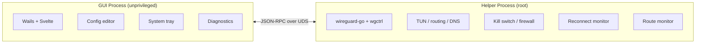

<p align="center">
  
</p>

<h1 align="center">WireGuide</h1>

<p align="center">
  A cross-platform WireGuard VPN client with modern UI and quality-of-life features.
</p>

<p align="center">
  <a href="https://github.com/korjwl1/wireguide/releases/latest"></a>
  <a href="#install"></a>
  
  <a href="LICENSE"></a>
</p>

<p align="center">
  <a href="README.ko.md">한국어</a>
</p>

---

## Why does this exist?

The official WireGuard macOS client (v1.0.16) hasn't been updated since February 2023. While it works fine for many users with standard setups, there are known issues that remain unpatched — particularly around split DNS, sleep/wake recovery, and missing features like a kill switch.

WireGuide was born out of a specific frustration: the official client caused severe system lag on an M1 MacBook Air after updating to macOS Tahoe, and no fix was available. Rather than waiting, I built an alternative that also adds features the official app doesn't have.

### Known issues with the official macOS client

These are documented issues — not all users experience them, but they've been reported and remain unfixed:

| Issue | Description | Reference |
|-------|-------------|-----------|
| **Split DNS** | DNS servers ignored unless AllowedIPs is `0.0.0.0/0` | [wireguard-apple PR #11](https://github.com/WireGuard/wireguard-apple/pull/11) — open 4+ years |
| **DNS persists after disconnect** | DNS not reverted after sleep/wake + disconnect | [wireguard-tools PR #22](https://github.com/WireGuard/wireguard-tools/pull/22) |
| **No kill switch** | No option to block traffic when tunnel drops | — |
| **No GitHub issues** | No public bug tracker | [HN discussion](https://news.ycombinator.com/item?id=43369111) |

### What WireGuide adds

- **Kill Switch** — blocks all non-VPN traffic via macOS `pf` (optional, off by default)
- **DNS Protection** — forces DNS queries through VPN only (optional)
- **Sleep/Wake Recovery** — detects wake events and handles reconnection
- **Route Monitor** — re-applies endpoint bypass routes on gateway changes
- **Config Editor** — CodeMirror 6 with WireGuard syntax highlighting and autocompletion
- **Drag-and-drop import** — drop `.conf` files to add tunnels
- **Health Check** — monitors handshake age, triggers reconnect if tunnel is unresponsive (optional, off by default, recommended with `PersistentKeepalive`)

### wireguard-go version

WireGuide uses wireguard-go from May 2025 (57 commits ahead of the version in the official app), which includes deadlock fixes, socket buffer improvements, and handshake performance gains. See the [wireguard-go commit log](https://github.com/WireGuard/wireguard-go/commits/master) for details.

---

## Install

### macOS (Homebrew)

```bash
brew tap korjwl1/tap
brew install --cask wireguide
```

### macOS (Manual)

Download from [Releases](https://github.com/korjwl1/wireguide/releases), unzip, move to `/Applications`.

> If macOS shows "app is damaged", run: `xattr -cr /Applications/WireGuide.app`

### Build from Source

```bash
# Prerequisites
brew install go node
go install github.com/go-task/task/v3/cmd/task@latest
go install github.com/wailsapp/wails/v3/cmd/wails3@latest

# Build
task build

# Run
./bin/wireguide
```

---

## Screenshots

<table>
  <tr>
    <td align="center"><br><sub>VPN Connected — real-time stats &amp; speed graph</sub></td>
    <td align="center"><br><sub>Config Editor — WireGuard syntax highlighting</sub></td>
  </tr>
  <tr>
    <td align="center"><br><sub>Editor Autocomplete — field suggestions</sub></td>
    <td align="center"><br><sub>Network Diagnostics</sub></td>
  </tr>
  <tr>
    <td align="center"><br><sub>Settings — theme, language, log level</sub></td>
    <td align="center"><br><sub>Log Viewer — level filtering, auto-scroll</sub></td>
  </tr>
  <tr>
    <td align="center"><br><sub>Empty State — drag &amp; drop .conf import</sub></td>
    <td align="center"><br><sub>System Tray Menu</sub></td>
  </tr>
</table>

---

## Features

| Feature | Description |
|---------|-------------|
| **Tunnel Management** | Import, create, edit, export `.conf` files. Drag-and-drop import. |
| **Config Editor** | CodeMirror 6 with WireGuard syntax highlighting and autocompletion |
| **System Tray** | Connection status badge (green dot), 1-click connect/disconnect |
| **Kill Switch** | Blocks all non-VPN traffic via macOS `pf` (optional) |
| **DNS Protection** | Forces DNS queries through the VPN tunnel only (optional) |
| **Health Check** | Handshake age monitoring with auto-reconnect (optional) |
| **Sleep/Wake Recovery** | Detects system wake and handles tunnel recovery |
| **Route Monitor** | Re-applies endpoint bypass routes on gateway changes |
| **Conflict Detection** | Warns about route conflicts with Tailscale, other WG interfaces, etc. |
| **Diagnostics** | Ping test, DNS leak test, route table visualization |
| **Auto-Update** | Checks GitHub Releases; supports `brew upgrade` and direct install |
| **Speed Dashboard** | Real-time RX/TX graph |
| **i18n** | English, Korean, Japanese |
| **Dark / Light / System** | Follows OS appearance |

---

## Architecture



- **Single binary** — `wireguide` runs as GUI or helper (`--helper` flag)
- **Privilege separation** — GUI is unprivileged; helper runs as root
- **IPC** — JSON-RPC over Unix socket (macOS/Linux) or named pipe (Windows)
- **Helper lifecycle** — Stays alive while tunnel is active (wg-quick semantics)

---

## Tech Stack

| Component | Technology |
|-----------|-----------|
| Language | Go 1.25+ |
| GUI | [Wails v3](https://wails.io) |
| Frontend | Svelte + Vite |
| WireGuard | [wireguard-go](https://git.zx2c4.com/wireguard-go) + [wgctrl-go](https://github.com/WireGuard/wgctrl-go) |
| IPC | JSON-RPC over Unix socket / Named pipe |
| Editor | [CodeMirror 6](https://codemirror.net/) |
| Firewall | macOS `pf` / Linux `nftables` / Windows `netsh advfirewall` |

---

## Sponsor

<a href="https://github.com/sponsors/korjwl1">
  
</a>

If WireGuide is useful to you, consider sponsoring to support development.

---

## License

[MIT](LICENSE)
