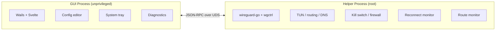

<p align="center">
  
</p>

<h1 align="center">WireGuide</h1>

<p align="center">
  <b>A WireGuard VPN client for people who don't want to think about WireGuard.</b>
</p>

<p align="center">
  <a href="https://github.com/korjwl1/wireguide/releases/latest"></a>
  <a href="https://github.com/korjwl1/wireguide/stargazers"></a>
  <a href="#install"></a>
  
  <a href="LICENSE"></a>
</p>

<p align="center">
  <a href="README.ko.md">한국어</a>
</p>

---

<table>
  <tr>
    <td align="center"><br><sub>VPN Connected</sub></td>
    <td align="center"><br><sub>Config Editor</sub></td>
  </tr>
  <tr>
    <td align="center"><br><sub>Autocomplete</sub></td>
    <td align="center"><br><sub>Settings</sub></td>
  </tr>
</table>

---

## Why WireGuide

Most WireGuard clients are built for the person who set up the server. WireGuide is built for the rest of the team.

Hand a `.conf` file to a non-technical coworker. They should be online in three steps:

1. Drag the file into WireGuide
2. Click **On**
3. (There is no step 3.)

That's the whole product from the user's side. Everything else is plumbing that quietly keeps the tunnel up, so the IT person doesn't have to keep fielding *"the VPN is broken again"* messages.

---

## Design

**Small surface, careful insides.**

The UI deliberately exposes a tiny number of things to click. Features that ship in WireGuide have to satisfy two rules:

1. They must not break the system when something goes wrong.
2. The everyday user must not need to know they exist.

That means most of WireGuide runs silently in the background.

### What the user sees

- Drag-and-drop `.conf` import (also QR and ZIP)
- A list of tunnels, each with one big toggle (sortable, resizable, optional compact mode)
- A tray icon that shows whether you're connected
- Per-tunnel **Automation** — connect or disconnect a tunnel automatically based on which network you're on (by Wi-Fi SSID, subnet, or the router's MAC address; rules are ordered by priority and drag-reorderable)
- A **command-line interface** (`wireguide ctl …`) for scripting — see below

### What runs silently underneath

- **Sleep/wake recovery** — the tunnel comes back after the lid closes
- **Route monitor** — keeps working when you move between Wi-Fi and Ethernet
- **Kill switch** — if the tunnel drops, nothing leaks while WireGuide is reconnecting. Uses the OS-native firewall (`pf` on macOS, WFP on Windows, `nftables` on Linux), not a userspace shim
- **Health check + auto-reconnect** — fixes a stalled handshake without the user noticing
- **DNS protection** — DNS queries are pinned to the tunnel
- **Conflict detection** — warns when another VPN (Tailscale, another WG interface) would step on routes

### For the person who set up the server

- Config editor with WireGuard syntax highlighting and autocomplete (CodeMirror 6)
- DNS leak test and route table view
- Real-time RX/TX dashboard
- Multi-tunnel — keep dev / staging / prod connected at once
- Per-tunnel notes and connection history

### Not included on purpose

- No account, no telemetry, no "Pro" tier
- No protocols other than WireGuard
- No bundled extras you didn't ask for

---

## Stability over features

WireGuide ships fewer knobs than most desktop VPN clients on purpose. The trade is that the few it does ship are meant to be boring and reliable.

- **Privilege separation.** A single binary runs in two modes. The GUI runs unprivileged. A small helper runs as root / Administrator. They talk over a local Unix socket (macOS/Linux) or named pipe (Windows). Nothing is exposed over HTTP or the network.
- **OS-native firewall.** The kill switch uses `pf` (macOS), WFP (Windows), or `nftables` (Linux) — not a userspace packet filter that fails open.
- **Up-to-date crypto.** Built on [wireguard-go](https://git.zx2c4.com/wireguard-go) (May 2025) — 57 commits ahead of the engine inside the official macOS app, which hasn't been updated since Feb 2023.
- **Manual QA per release.** Every tagged release is exercised on macOS (Apple Silicon) and Windows 11 (amd64) before it goes out.

If something breaks, helper logs are plain text — not behind a paywall. Open an issue and attach them.

---

## Install

Tested on **macOS 15+ (Apple Silicon)** and **Windows 11 (amd64)**.

### macOS (Homebrew) — recommended

```bash
brew tap korjwl1/tap
brew install --cask wireguide
```

### macOS (Manual)

Download from [Releases](https://github.com/korjwl1/wireguide/releases), unzip, move to `/Applications`.

> If macOS shows "app is damaged", run: `xattr -cr /Applications/WireGuide.app`

### Windows (Installer)

Download the latest `WireGuide-windows-amd64.exe` (or `-arm64.exe`) installer from
[Releases](https://github.com/korjwl1/wireguide/releases) and run it. The NSIS
installer registers the helper service and shortcut.

> Windows SmartScreen may warn that the publisher is unknown — the binary is
> currently unsigned. Click "More info" → "Run anyway".

### Build from Source

```bash
brew install go node
go install github.com/go-task/task/v3/cmd/task@latest
go install github.com/wailsapp/wails/v3/cmd/wails3@latest

task build
./bin/wireguide
```

---

## Command line

WireGuide ships a small CLI, `wireguide ctl`, for scripting and automation. Like
`tailscale`/`tailscaled`, it talks to the already-running (already-elevated)
helper over the local socket — so unlike `wg-quick` it needs no per-command
`sudo`, works the same on macOS/Windows/Linux, and shares the GUI's tunnel store.

```
wireguide ctl status                    # connection status
wireguide ctl list                      # list tunnels (● = connected)
wireguide ctl connect <name>            # connect a tunnel
wireguide ctl disconnect [name]         # disconnect one (or all)
wireguide ctl import <file> [name]      # import a .conf
wireguide ctl rename <old> <new>
wireguide ctl delete <name>

# Automation — per-tunnel connect/disconnect rules (top rule wins on conflict):
wireguide ctl automation                # what the engine decides right now
wireguide ctl automation rules <name>   # list a tunnel's rules
wireguide ctl automation add <name> <connect|disconnect> <cond>
    #   cond = ssid:<wifi>  subnet:<CIDR>  mac:<gateway-MAC>  else
wireguide ctl automation rm <name> <n>

# e.g. turn the work VPN off on the office network, on everywhere else:
wireguide ctl automation add work disconnect mac:b0:38:6c:54:8b:ab
wireguide ctl automation add work connect else
```

Connect/disconnect/status need the app (or its helper) running; list, import,
rename, delete and automation edits work directly against the local files.

---

## Architecture



- **Single binary** — `wireguide` runs as GUI or helper (`--helper` flag)
- **Privilege separation** — GUI is unprivileged; helper runs as root
- **IPC** — JSON-RPC over Unix socket (macOS/Linux) or named pipe (Windows)

---

## Tech Stack

| Component | Technology |
|-----------|-----------|
| Language | Go 1.25+ |
| GUI | [Wails v3](https://wails.io) |
| Frontend | Svelte + Vite |
| WireGuard | [wireguard-go](https://git.zx2c4.com/wireguard-go) + [wgctrl-go](https://github.com/WireGuard/wgctrl-go) |
| Editor | [CodeMirror 6](https://codemirror.net/) |
| Firewall | macOS `pf` / Linux `nftables` / Windows WFP (Filtering Platform) |
| i18n | English, Korean, Japanese |

---

## Contributing

See [CONTRIBUTING.md](CONTRIBUTING.md) for development setup and guidelines.

Found a bug? [Open an issue](https://github.com/korjwl1/wireguide/issues/new/choose).

---

## Sponsor

<a href="https://github.com/sponsors/korjwl1">
  
</a>

If WireGuide is useful to you, consider sponsoring to support development.

---

## License

[MIT](LICENSE)
